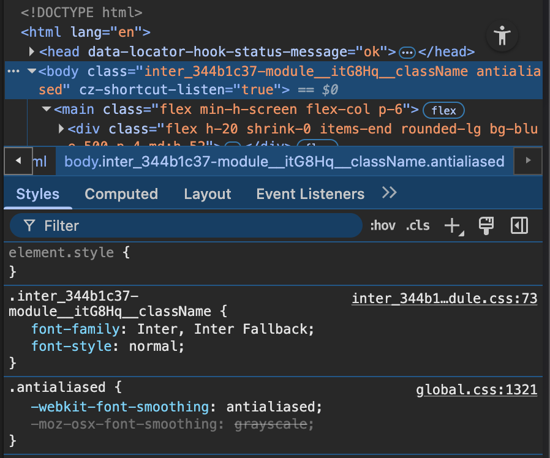

<https://nextjs.org/learn>

## 📗 App Router

### 3. Optimizing Fonts and Images

**폰트** **최적화**

- 커스텀 폰트는 성능에 영향, 레이아웃 밀림(CLS) 유발 가능.
- next/font 사용 시, 폰트 파일을 빌드 타임에 다운받아 정적 자산으로 호스팅. 추가 네트워크 요청 없음.

**/app/ui/fonts.ts**

```ts
import { Inter, Lusitana } from "next/font/google";

export const inter = Inter({ subsets: ["latin"] });
export const lusitana = Lusitana({
  subsets: ["latin"],
  weight: ["400", "700"],
});
```

**/app/layout.tsx**

```ts
import "@/app/ui/global.css";
import { inter } from "@/app/ui/fonts";

export default function RootLayout({ children }) {
  return (
    <html lang="en">
      <body className={`${inter.className} antialiased`}>{children}</body>
    </html>
  );
}
```

- 안티앨리어싱(antialiasing)은 픽셀 단위로 계단 현상(jagged edges, aliasing)을 줄여줌.
- 글자가 더 자연스럽고 깔끔하게 보임.
- 주로 고해상도 화면이나 작은 글씨에서 효과가 더 잘 드러남.

**/app/page.tsx** (특정 요소에 서브 폰트 적용)

```ts
import { lusitana } from "@/app/ui/fonts";

export default function Page() {
  return <p className={lusitana.className}>서브 폰트 적용 예시</p>;
}
```

<br>



**이미지** **최적화**

- 일반 img 태그는 반응형, 사이즈 지정, 레이아웃 밀림, lazy loading 등 직접 처리 필요.
- next/image 컴포넌트 사용 시, 자동으로 최적화(레이아웃 밀림 방지, 리사이즈, lazy loading, 최신 포맷 지원).

**/app/page.tsx**

```ts
import Image from "next/image";

export default function Page() {
  return (
    <div>
      {/* 데스크탑용 이미지 */}
      <Image
        src="/hero-desktop.png"
        width={1000}
        height={760}
        className="hidden md:block"
        alt="Screenshots of the dashboard project showing desktop version"
      />
      {/* 모바일용 이미지 */}
      <Image
        src="/hero-mobile.png"
        width={560}
        height={620}
        className="block md:hidden"
        alt="Screenshots of the dashboard project showing mobile version"
      />
    </div>
  );
}
```

**핵심** **요약**

- 폰트/이미지 최적화하면 레이아웃 밀림 줄이고 성능 향상.
- next/font, next/image 쓰면 자동으로 최적화됨.
- width, height 꼭 지정해서 CLS 방지.

---

### 4. Creating Layouts and Pages

**라우트** **생성**

- 폴더가 URL 세그먼트, page.tsx가 해당 경로의 페이지가 됨.

**예시: /dashboard 페이지 만들기**

**/app/dashboard/page.tsx**

```ts
export default function Page() {
  return <p>Dashboard Page</p>;
}
```

- 위처럼 폴더와 page.tsx 파일 만들면 /dashboard 경로에서 페이지 확인 가능.

**서브** **페이지** **추가** **예시**

**/app/dashboard/customers/page.tsx<br>
/app/dashboard/invoices/page.tsx**

```ts
// customers
export default function Page() {
  return <p>Customers Page</p>;
}

// invoices
export default function Page() {
  return <p>Invoices Page</p>;
}
```

**레이아웃** **적용**

- layout.tsx 파일을 폴더에 추가하면, 그 폴더 하위 모든 페이지에 공통 UI 적용됨.

**예시: /dashboard 레이아웃**

**/app/dashboard/layout.tsx**

```ts
import SideNav from "@/app/ui/dashboard/sidenav";

export default function Layout({ children }) {
  return (
    <div className="flex h-screen flex-col md:flex-row md:overflow-hidden">
      <div className="w-full flex-none md:w-64">
        <SideNav />
      </div>
      <div className="flex-grow p-6 md:overflow-y-auto md:p-12">{children}</div>
    </div>
  );
}
```

- children에 하위 페이지가 자동으로 들어감.
- 페이지를 이동해도 레이아웃은 유지되고, 페이지 컴포넌트만 바뀜(Partial Rendering).

**루트** **레이아웃**

- /app/layout.tsx는 모든 페이지에 공통 적용됨(글로벌 폰트, 스타일 등).

**/app/layout.tsx**

```ts
import "@/app/ui/global.css";
import { inter } from "@/app/ui/fonts";

export default function RootLayout({ children }) {
  return (
    <html lang="en">
      <body className={`${inter.className} antialiased`}>{children}</body>
    </html>
  );
}
```

**핵심 요약**

- 폴더/파일 구조만 잘 만들면 라우트와 레이아웃 자동 적용.
- layout.tsx로 공통 UI 쉽게 관리 가능.
- page.tsx로 각 경로별 페이지 생성.
- Colocation(폴더 내 컴포넌트, 테스트 등 같이 관리) 가능.

---

### 5. Navigating Between Pages

**Link** **컴포넌트로** **네비게이션** **최적화**

- 기존 `<a>` 태그로 페이지 이동 시 전체 새로고침 발생
- Next.js의 `<Link>` 컴포넌트 사용 시, 클라이언트 사이드 네비게이션으로 부드럽게 이동 (전체 새로고침 없음)
- 코드 스플리팅 및 prefetch 기능으로 빠른 전환 지원

```ts
import Link from "next/link";

export default function NavLinks() {
  return (
    <>
      <Link href="/dashboard">Dashboard</Link>
      <Link href="/dashboard/customers">Customers</Link>
      <Link href="/dashboard/invoices">Invoices</Link>
    </>
  );
}
```

**Automatic code-splitting and prefetching**

- Next.js는 각 라우트별로 코드를 분할(code-splitting)해서, 필요한 페이지만 로드함.
- 한 페이지에서 에러가 나도 다른 페이지에는 영향 없음.
- 전체 코드가 아니라 필요한 부분만 불러와서 성능이 좋아짐.
- 프로덕션 환경에서는 `<Link>`가 화면에 보이면, Next.js가 해당 경로의 코드를 백그라운드에서 미리 받아옴(prefetch).
- 사용자가 링크를 클릭할 때 이미 코드가 준비되어 있어서, 거의 즉시 페이지 전환됨.

**활성(Active) 링크 표시**

- 현재 경로와 일치하는 링크에만 스타일 적용
- `usePathname()` 훅으로 현재 경로 확인
  - 리액트 훅이기 때문에 `'use client'` 추가하여 클라이언트 컴포넌트로 변경
- `clsx` 라이브러리로 조건부 클래스 적용

```ts
"use client";
import Link from "next/link";
import { usePathname } from "next/navigation";
import clsx from "clsx";

const links = [
  { name: "Dashboard", href: "/dashboard" },
  { name: "Customers", href: "/dashboard/customers" },
  { name: "Invoices", href: "/dashboard/invoices" },
];

export default function NavLinks() {
  const pathname = usePathname();
  return (
    <>
      {links.map((link) => (
        <Link
          key={link.name}
          href={link.href}
          className={clsx("기본 스타일 클래스", {
            "bg-sky-100 text-blue-600": pathname === link.href,
          })}
        >
          {link.name}
        </Link>
      ))}
    </>
  );
}
```

- `pathname === link.href`일 때만 활성화 스타일(`bg-sky-100 text-blue-600`) 적용

**핵심** **요약**

- `<Link>` 컴포넌트로 전체 새로고침 없이 빠른 페이지 이동 가능
- 자동 코드 스플리팅, prefetch로 성능 향상
- `usePathname()`와 `clsx`로 현재 위치에 따라 활성 링크 스타일 적용
