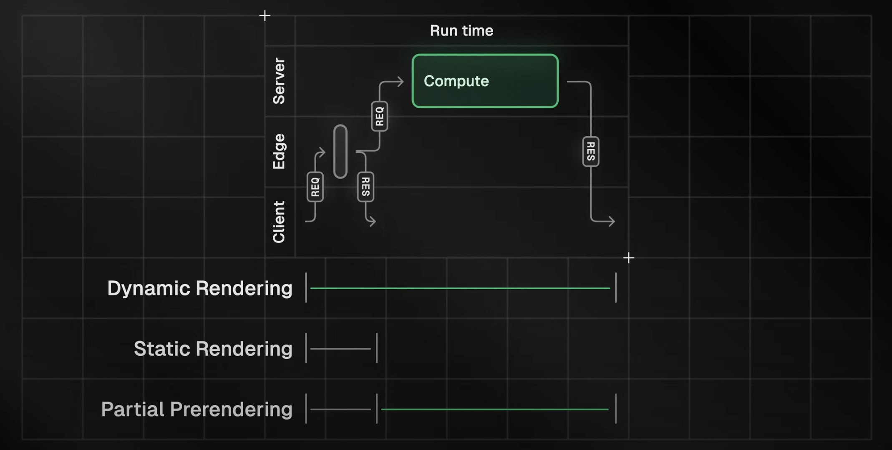

<https://nextjs.org/learn>

## 📗 App Router

### 3. Optimizing Fonts and Images

**폰트** **최적화**

- 커스텀 폰트는 성능에 영향, 레이아웃 밀림(CLS) 유발 가능.
- next/font 사용 시, 폰트 파일을 빌드 타임에 다운받아 정적 자산으로 호스팅. 추가 네트워크 요청 없음.

**/app/ui/fonts.ts**

```ts
import { Inter, Lusitana } from "next/font/google";

export const inter = Inter({ subsets: ["latin"] });
export const lusitana = Lusitana({
  subsets: ["latin"],
  weight: ["400", "700"],
});
```

**/app/layout.tsx**

```ts
import "@/app/ui/global.css";
import { inter } from "@/app/ui/fonts";

export default function RootLayout({ children }) {
  return (
    <html lang="en">
      <body className={`${inter.className} antialiased`}>{children}</body>
    </html>
  );
}
```

- 안티앨리어싱(antialiasing)은 픽셀 단위로 계단 현상(jagged edges, aliasing)을 줄여줌.
- 글자가 더 자연스럽고 깔끔하게 보임.
- 주로 고해상도 화면이나 작은 글씨에서 효과가 더 잘 드러남.

**/app/page.tsx** (특정 요소에 서브 폰트 적용)

```ts
import { lusitana } from "@/app/ui/fonts";

export default function Page() {
  return <p className={lusitana.className}>서브 폰트 적용 예시</p>;
}
```

<br>


**이미지** **최적화**

- 일반 img 태그는 반응형, 사이즈 지정, 레이아웃 밀림, lazy loading 등 직접 처리 필요.
- next/image 컴포넌트 사용 시, 자동으로 최적화(레이아웃 밀림 방지, 리사이즈, lazy loading, 최신 포맷 지원).

**/app/page.tsx**

```ts
import Image from "next/image";

export default function Page() {
  return (
    <div>
      {/* 데스크탑용 이미지 */}
      <Image
        src="/hero-desktop.png"
        width={1000}
        height={760}
        className="hidden md:block"
        alt="Screenshots of the dashboard project showing desktop version"
      />
      {/* 모바일용 이미지 */}
      <Image
        src="/hero-mobile.png"
        width={560}
        height={620}
        className="block md:hidden"
        alt="Screenshots of the dashboard project showing mobile version"
      />
    </div>
  );
}
```

**핵심** **요약**

- 폰트/이미지 최적화하면 레이아웃 밀림 줄이고 성능 향상.
- next/font, next/image 쓰면 자동으로 최적화됨.
- width, height 꼭 지정해서 CLS 방지.

---

### 4. Creating Layouts and Pages

**라우트** **생성**

- 폴더가 URL 세그먼트, page.tsx가 해당 경로의 페이지가 됨.

**예시: /dashboard 페이지 만들기**

**/app/dashboard/page.tsx**

```ts
export default function Page() {
  return <p>Dashboard Page</p>;
}
```

- 위처럼 폴더와 page.tsx 파일 만들면 /dashboard 경로에서 페이지 확인 가능.

**서브** **페이지** **추가** **예시**

**/app/dashboard/customers/page.tsx<br>
/app/dashboard/invoices/page.tsx**

```ts
// customers
export default function Page() {
  return <p>Customers Page</p>;
}

// invoices
export default function Page() {
  return <p>Invoices Page</p>;
}
```

**레이아웃** **적용**

- layout.tsx 파일을 폴더에 추가하면, 그 폴더 하위 모든 페이지에 공통 UI 적용됨.

**예시: /dashboard 레이아웃**

**/app/dashboard/layout.tsx**

```ts
import SideNav from "@/app/ui/dashboard/sidenav";

export default function Layout({ children }) {
  return (
    <div className="flex h-screen flex-col md:flex-row md:overflow-hidden">
      <div className="w-full flex-none md:w-64">
        <SideNav />
      </div>
      <div className="flex-grow p-6 md:overflow-y-auto md:p-12">{children}</div>
    </div>
  );
}
```

- children에 하위 페이지가 자동으로 들어감.
- 페이지를 이동해도 레이아웃은 유지되고, 페이지 컴포넌트만 바뀜(Partial Rendering).

**루트** **레이아웃**

- /app/layout.tsx는 모든 페이지에 공통 적용됨(글로벌 폰트, 스타일 등).

**/app/layout.tsx**

```ts
import "@/app/ui/global.css";
import { inter } from "@/app/ui/fonts";

export default function RootLayout({ children }) {
  return (
    <html lang="en">
      <body className={`${inter.className} antialiased`}>{children}</body>
    </html>
  );
}
```

**핵심 요약**

- 폴더/파일 구조만 잘 만들면 라우트와 레이아웃 자동 적용.
- layout.tsx로 공통 UI 쉽게 관리 가능.
- page.tsx로 각 경로별 페이지 생성.
- Colocation(폴더 내 컴포넌트, 테스트 등 같이 관리) 가능.

---

### 5. Navigating Between Pages

**Link** **컴포넌트로** **네비게이션** **최적화**

- 기존 `<a>` 태그로 페이지 이동 시 전체 새로고침 발생
- Next.js의 `<Link>` 컴포넌트 사용 시, 클라이언트 사이드 네비게이션으로 부드럽게 이동 (전체 새로고침 없음)
- 코드 스플리팅 및 prefetch 기능으로 빠른 전환 지원

```ts
import Link from "next/link";

export default function NavLinks() {
  return (
    <>
      <Link href="/dashboard">Dashboard</Link>
      <Link href="/dashboard/customers">Customers</Link>
      <Link href="/dashboard/invoices">Invoices</Link>
    </>
  );
}
```

**Automatic code-splitting and prefetching**

- Next.js는 각 라우트별로 코드를 분할(code-splitting)해서, 필요한 페이지만 로드함.
- 한 페이지에서 에러가 나도 다른 페이지에는 영향 없음.
- 전체 코드가 아니라 필요한 부분만 불러와서 성능이 좋아짐.
- 프로덕션 환경에서는 `<Link>`가 화면에 보이면, Next.js가 해당 경로의 코드를 백그라운드에서 미리 받아옴(prefetch).
- 사용자가 링크를 클릭할 때 이미 코드가 준비되어 있어서, 거의 즉시 페이지 전환됨.

**활성(Active) 링크 표시**

- 현재 경로와 일치하는 링크에만 스타일 적용
- `usePathname()` 훅으로 현재 경로 확인
  - 리액트 훅이기 때문에 `'use client'` 추가하여 클라이언트 컴포넌트로 변경
- `clsx` 라이브러리로 조건부 클래스 적용

```ts
"use client";
import Link from "next/link";
import { usePathname } from "next/navigation";
import clsx from "clsx";

const links = [
  { name: "Dashboard", href: "/dashboard" },
  { name: "Customers", href: "/dashboard/customers" },
  { name: "Invoices", href: "/dashboard/invoices" },
];

export default function NavLinks() {
  const pathname = usePathname();
  return (
    <>
      {links.map((link) => (
        <Link
          key={link.name}
          href={link.href}
          className={clsx("기본 스타일 클래스", {
            "bg-sky-100 text-blue-600": pathname === link.href,
          })}
        >
          {link.name}
        </Link>
      ))}
    </>
  );
}
```

- `pathname === link.href`일 때만 활성화 스타일(`bg-sky-100 text-blue-600`) 적용

**핵심** **요약**

- `<Link>` 컴포넌트로 전체 새로고침 없이 빠른 페이지 이동 가능
- 자동 코드 스플리팅, prefetch로 성능 향상
- `usePathname()`와 `clsx`로 현재 위치에 따라 활성 링크 스타일 적용

---

### 7. Fetching Data

**Choosing how to fetch data**

- **API** **레이어**

  - 클라이언트에서 직접 DB 쿼리하면 보안상 위험(비밀 노출).
  - 클라이언트에서 데이터 가져올 땐 서버에 API 레이어 만들어서 DB 접근해야 함.
  - Next.js에서는 Route Handlers로 API 엔드포인트 만들 수 있음.

- **DB** **쿼리**

  - 서버 컴포넌트(React Server Component)에서는 API 레이어 없이 DB 직접 쿼리 가능(비밀 노출 위험 없음).
  - API 엔드포인트 만들 때도 DB 쿼리 필요.

- **React Server Component로 데이터 패칭**

  - async/await로 비동기 데이터 패칭 가능.
  - 서버에서만 실행되므로 DB 직접 쿼리해도 안전.
  - API 레이어 없이 바로 DB 접근 가능해서 코드가 단순해짐.

- **SQL** **사용** **이유**
  - SQL은 관계형 DB 표준 쿼리 언어.
  - 원하는 데이터만 정확하게 가져오고, 조작 가능.
  - postgres.js 라이브러리로 SQL 인젝션 방지.
  - SQL을 알면 다른 도구나 ORM 쓸 때도 이해에 도움 됨.

<br>

**Waterfall / Parallel data fetching**

- **워터폴** **패칭**

  - 각 데이터 요청이 앞선 요청이 끝나야 다음이 시작됨(순차 실행).
  - 예: `fetchRevenue()` → 끝나면 `fetchLatestInvoices()` → 끝나면 `fetchCardData()`
  - 의도적으로 순서가 필요할 때(예: ID를 먼저 받아야 할 때) 사용.
  - 하지만 불필요하게 워터폴이 생기면 성능 저하.

- **병렬** **패칭**
  - 모든 데이터 요청을 동시에 시작함.
  - JavaScript의 `Promise.all()` 또는 `Promise.allSettled()`로 구현.
  - 병렬로 실행하면 전체 대기 시간이 줄어들어 더 빠름.
  - **단점**: 병렬 요청 중 하나가 느리면 전체가 느려질 수 있음.
    ```ts
    const data = await Promise.all([
      invoiceCountPromise,
      customerCountPromise,
      invoiceStatusPromise,
    ]);
    ```

---

### 8. Static and Dynamic Rendering

**Static Rendering(정적 렌더링)**

- **정의**: 빌드 타임(배포 시점)이나 데이터 재검증(revalidating data) 시 서버에서 미리 데이터를 패칭하고 HTML을 생성함.
  - 재검증(Revalidating)
    - 정적 렌더링된(캐시된) 데이터를 일정 주기나 조건에 따라 서버에서 새로 받아와 업데이트하는 것
    - 최신 데이터가 필요할 때 캐시를 새로고침하는 개념
    - Next.js에서는 ISR(Incremental Static Regeneration)로도 불림
- **장점**
  - 빠른 웹사이트(캐시된 결과를 전 세계에 배포)
  - 서버 부하 감소(캐시 활용)
  - SEO에 유리(크롤러가 바로 콘텐츠 확인 가능)
- **단점**
  - 데이터가 자주 바뀌거나 사용자별로 달라지는 대시보드에는 부적합(최신 데이터 반영 안 됨)

**Dynamic Rendering(동적 렌더링)**

- **정의**: 사용자가 페이지를 방문할 때마다 서버에서 데이터를 패칭하고 HTML을 생성함(요청 시점 렌더링).
- **장점**
  - 실시간 데이터 반영 가능
  - 사용자별 맞춤 데이터 제공(예: 대시보드, 프로필)
  - 요청 시점에만 알 수 있는 정보(쿠키, URL 파라미터 등) 활용 가능
- **단점**
  - 데이터 패칭이 느리면 전체 페이지 렌더링이 느려짐(가장 느린 요청에 전체가 묶임)
    ```ts
    export async function fetchRevenue() {
      try {
        // 3초 인위적 지연(실제 서비스에서는 사용 X)
        console.log("Fetching revenue data...");
        await new Promise((resolve) => setTimeout(resolve, 3000));
        const data = await sql`SELECT * FROM revenue`;
        console.log("Data fetch completed after 3 seconds.");
        return data;
      } catch (error) {
        console.error("Database Error:", error);
        throw new Error("Failed to fetch revenue data.");
      }
    }
    ```
    - 위처럼 데이터 패칭이 느리면, 전체 페이지가 데이터가 올 때까지 블로킹됨.

**핵심** **요약**

- Static Rendering: 빠르고 캐시 활용, 하지만 실시간/개인화 데이터엔 부적합
- Dynamic Rendering: 실시간/개인화에 적합, 하지만 느린 데이터 패칭이 전체 속도에 영향
- 동적 렌더링에서는 “가장 느린 데이터 요청”이 전체 페이지 속도를 결정함

---

### 9. Streaming

**Streaming**

- 데이터를 여러 chunk로 나눠서 순차적으로 클라이언트에 보내주는 방식
- 느린 데이터 요청이 전체 페이지 로딩을 막지 않게 해줌
- React 컴포넌트 모델과 잘 맞음

**Streaming** **구현** **방법**

- 페이지 단위: `loading.tsx` 파일 사용하면 Next.js가 자동으로 `<Suspense>` 처리해줌
- 컴포넌트 단위: 직접 `<Suspense>`로 감싸서 더 세밀하게 제어 가능

**loading.tsx와 Skeleton**

- `loading.tsx`에 fallback UI 작성하면 페이지가 로딩 중일 때 보여줌
- 단순한 ‘Loading…’ 대신 skeleton UI 넣으면 사용자 경험 더 좋아짐
- skeleton UI는 정적 파일로 먼저 전송됨

**Route Groups**

- `loading.tsx`가 상위 폴더에 있으면 하위 경로에도 적용됨
- Route Group(`(overview)` 등) 폴더로 감싸면 특정 경로에만 loading UI 적용 가능
- 괄호 폴더는 URL에 노출 안 됨

**컴포넌트** **Streaming**

- 데이터 fetch를 각 컴포넌트로 내리면 해당 부분만 Suspense로 감쌀 수 있음
- 예시: `<RevenueChart>` 컴포넌트에서 직접 데이터 fetch, Suspense로 감싸서 skeleton 보여줌
- `<LatestInvoices>`도 같은 방식으로 처리 가능

**컴포넌트** **그룹화**

- 여러 컴포넌트를 한 번에 Suspense로 감싸면 skeleton 한 번만 보여주고, 다 같이 로드됨
- wrapper 컴포넌트(`CardWrapper` 등)로 묶어서 사용

**Suspense boundary** **위치** **선정**

- 사용자 경험, 데이터 의존도에 따라 Suspense boundary 위치 결정해야 함
- 너무 세분화하면 UI가 하나씩 툭툭 튀어나오는 느낌 날 수 있음
- 섹션별, 전체, 개별 등 다양한 방식 실험해볼 것 추천함
- 일반적으로 데이터 fetch는 각 컴포넌트로 내리는 게 좋음

---

### 10. Partial Prerendering

- Partial Prerendering(PPR)은 Next.js 14에서 도입된 실험적 기능으로, 한 라우트 내에서 정적(static) 렌더링과 동적(dynamic) 렌더링, 그리고 스트리밍을 결합할 수 있게 해줌
- 예를 들어, 상품 정보 페이지에서 네비게이션 바와 상품 정보는 정적으로 미리 렌더링하고, 장바구니나 추천 상품 등 개인화된 동적 콘텐츠는 비동기로 불러올 수 있음
- 사용자는 빠르게 정적 셸(shell)을 받아볼 수 있고, 동적 콘텐츠는 “구멍(holes)“에 비동기로 스트리밍되어 전체 로딩 시간을 줄일 수 있음
- PPR은 React의 Suspense를 활용하여, 동적 콘텐츠가 준비될 때까지 해당 부분의 렌더링을 미룸
- 사용 방법: ‎`next.config.ts`에 experimental 옵션을 추가하고, 동적이 필요한 레이아웃 파일에 ‎`experimental_ppr`을 true로 설정
- 현재 PPR은 Next.js의 canary(실험) 버전에서만 사용할 수 있으며, 아직 프로덕션 환경에서는 권장되지 않음
- PPR의 장점: 코드 변경 없이 Suspense로 동적 부분만 감싸면 Next.js가 자동으로 정적/동적 부분을 구분해 처리해준다




**PPR과 Streaming의 차이점?**


**Partial Prerendering (PPR)**

- **정적/동적 분리**
  - 빌드 타임에 가능한 모든 부분(정적 콘텐츠)은 미리 렌더링해서 HTML로 만들어 둠
  - 동적 데이터가 필요한 부분(예: 사용자별 정보, 실시간 데이터 등)은 Suspense로 감싸고, 이 부분만 런타임(요청 시)에 서버에서 렌더링
- **장점**
  - 사용자는 페이지의 “정적 shell”을 즉시 받아볼 수 있어, 첫 화면이 매우 빠르게 보임
  - 동적 부분은 나중에 비동기로 채워지므로, 전체적인 체감 속도가 빨라짐
- **적용** **시점**
  - 빌드 타임 + 요청 시(동적 부분만)
- **실제** **동작**
  - 정적 부분은 CDN 등에서 바로 서빙, 동적 부분만 서버에서 처리

**Streaming/Suspense**

- **전체** **페이지** **렌더링**
  - 페이지 전체를 요청 시점에 서버에서 렌더링
  - Suspense를 사용하면, 데이터가 느린 부분은 fallback UI(스켈레톤 등)를 먼저 보여주고, 데이터가 준비되면 해당 부분만 교체
  - 여러 데이터 fetch를 병렬로 처리할 수 있음
- **장점**
  - 동적 데이터가 많거나, 모든 부분이 자주 바뀌는 페이지에 적합
  - 컴포넌트 단위로 세밀하게 streaming 제어 가능
- **적용** **시점**
  - 오직 요청 시(런타임)
- **실제** **동작**
  - 모든 HTML이 서버에서 실시간으로 생성되어 전송

---

### 11. Adding Search and Pagination

- useSearchParams: 현재 URL의 쿼리 파라미터 읽을 때 씀.
  - /dashboard/invoices?page=1&query=abc → {page: ‘1’, query: ‘abc’}
- usePathname: 현재 경로(pathname) 읽을 때 씀
  - /dashboard/invoices
- useRouter: 클라이언트 컴포넌트에서 프로그래밍적으로 라우팅(이동)할 때 씀.
  - replace, push 등 메서드 제공

**URL search params를 사용할 때의 장점**

- URL에 검색어/필터가 들어가므로 사용자가 현재 상태를 북마크하거나 공유할 수 있음.
- 서버사이드 렌더링할 때 URL 파라미터로 바로 초기 상태 만들 수 있어서 편함.
- 검색어/필터가 URL에 있으니, 별도 코드 없이도 사용자 행동 추적(분석)이 쉬움
